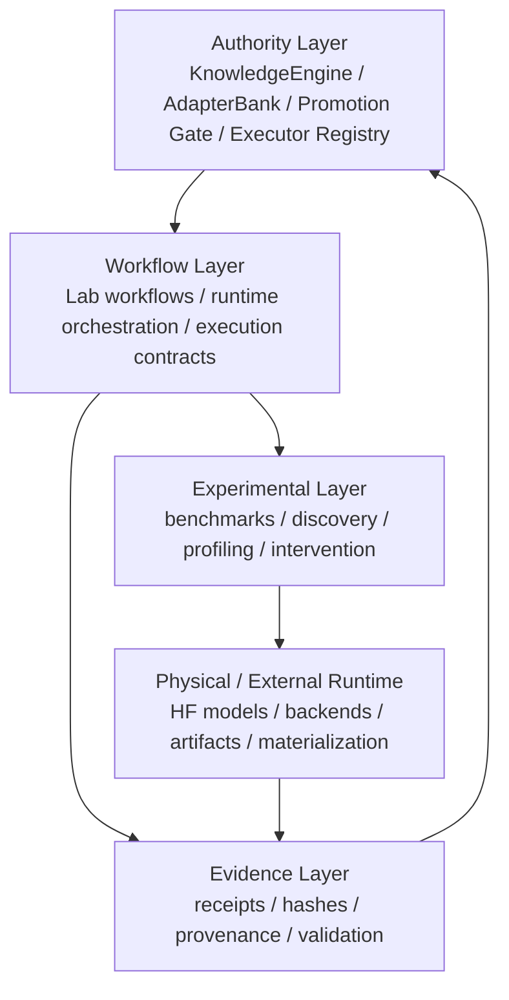

# Arquitectura formal de TIDE-X

## 1. Principio rector

TIDE-X no es un “lab” genérico ni una simulación de inteligencia. El proyecto define una separación explícita entre:

- autoridad: la capa que decide, autentica y puede bloquear o autorizar;
- workflow: la secuencia de ejecución que conecta autores, ejecutores, artefactos y evidencia;
- evidencia: la prueba verificable de que un paso fue ejecutado, con identidad, hash y validación;
- experimento: una trayectoria diagnóstica o de investigación que no equivale a producción ni a autoridad final.

La arquitectura real vive en Rust y en los contratos de ejecución del runtime. La interfaz web es la vista operativa de TIDE-X, no un producto aparte ni un laboratorio.

## 2. Dominio de autoridad

La autoridad del sistema se mantiene en los componentes de runtime y gobernanza, especialmente:

- KnowledgeEngine: decide planeación, obligaciones y cierre de pasos. Expone `living_staircase()` como proyección de obligaciones, no como orquestador del árbol.
- ResidencyDecision: valida la residencia de capacidades según el contexto y la evidencia.
- AdapterBank: coordina la vida real del adapter, con autorización, activación, revocación y rollback.
- Promotion gate: verifica que una capacidad o un materialized candidate está lista para avanzar.
- Executor registry: catálogo declarado de estado, madurez, autoridad, evidencia y superficies. No es un runtime: `ExecutorDescriptor::new` marca todos los descriptores como `Implemented`, y coexisten estados `ArchitectureOnly`. El único `production_authority` es `adapter.bank`.

Estos dominios no son “decorativos”. Son la capa que restringe el alcance del sistema y evita la agencia automática sin validación.

## 3. Dominio de workflow

El workflow conecta los ejecutores reales y los artefactos dentro de la lógica del sistema. Su misión es:

- seleccionar el executor correcto;
- preparar argumentos y artefactos;
- ejecutar la operación con restricciones explícitas;
- persistir evidencia del resultado;
- decidir si continúa, bloquea o pide más evidencia.

En TIDE-X, el workflow no sustituye a la autoridad. Lo que hace es orquestar la ejecución y preservar trazabilidad.

## 4. Dominio de evidencia

La evidencia es la capa de integridad del sistema. Todo paso útil debe responder a preguntas como:

- ¿qué entidad hizo la acción?
- ¿qué entrada recibía?
- ¿qué artefacto se generó?
- ¿cómo se valida la salida?
- ¿qué hash o receipt la identifica?
- ¿cuál es el contrato aplicable?

Cuando la evidencia no encaja, el sistema debe bloquear la promoción o recalcular el estado. No se promueve una hipótesis como “real” por una UI bonita o una respuesta plausible.

## 5. Dominio experimental

Hay tareas válidas de investigación o diagnóstico que no son autoridad, ni producción ni finalización:

- benchmarks comparativos;
- cross-model discovery;
- transfer experiments;
- model profiling y diagnosis;
- analysis de arquitectura/activations;
- materialización aislada como análisis, no como activation.

Estas rutas pertenecen a la interfaz y a la capa experimental, pero deben quedar explícitamente separadas de la activación productiva y de la promoción automática.

## 6. Arquitectura de capas

## 7. Relación con la interfaz

La interfaz web de TIDE-X debe comunicar estas realidades con claridad:

- qué es cada bloque o área;
- para qué sirve;
- qué autoridad usa;
- qué tipo de salida produce;
- si está en una ruta de experimentación o de decisión autorizada.

La intención es que la UI ayude a orquestar el runtime existente, no a hacer creer que todos los módulos son equivalentes.

## 8. Reglas de diseño que siguen vigentes

1. No se inventa autoridad ni se promueve una capacidad sin evidencia.
2. La plasticidad modifica dentro de límites; no reemplaza la autoridad central.
3. La interfaz ejecuta workflows reales y modelos autenticados, pero no convierte una prueba en producción.
4. El `executor_registry` declara la semántica del catálogo, incluso cuando un módulo es advisory o experimental. Esa declaración no sustituye al código de autoridad.
5. La producción y la investigación son caminos distintos, con requisitos distintos de firma y validación.

## 9. Resultado esperado

El sistema queda más profesional cuando cada dominio tiene una identidad clara, una función clara y una regla clara de autoridad. Eso permite que la UI, la documentación, la gobernanza y el runtime hablen el mismo idioma.
