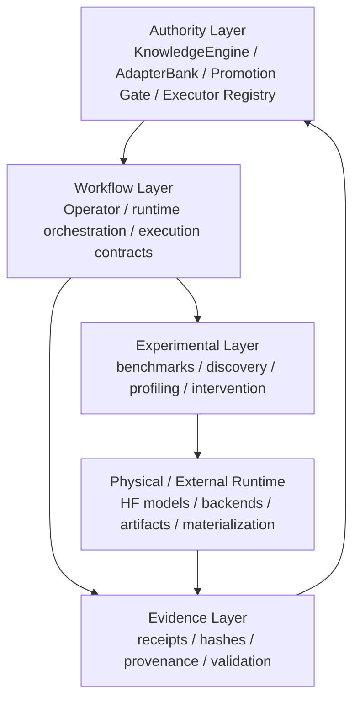

# Arquitectura formal de TIDE-X

Separación explícita entre autoridad, workflow, evidencia y experimentación. La UI es vista operativa del runtime Rust, no un producto aparte.

**Ubicación:** `docs/ARCHITECTURE.md`  
**Relacionado:** [INDEX](INDEX.md) · [SYSTEM_STATUS](SYSTEM_STATUS.md) · [directories/src](directories/src.md) · sistemas en [systems/](systems/)

## 1. Principio rector

- **autoridad** — decide, autentica, bloquea o autoriza;
- **workflow** — secuencia de ejecución con contratos;
- **evidencia** — prueba verificable (identidad, hash, validación);
- **experimento** — trayectoria diagnóstica ≠ producción.

## 2. Mapa de dominios `src/` (post-reorg `8091cc8`)

| Dominio | Responsabilidad | Doc |
|---------|-----------------|-----|
| `foundation` | Digests, autoridad de instancia, álgebra, validación | [directories/src-foundation](directories/src-foundation.md) |
| `knowledge` | KnowledgeEngine / receipts / living_staircase proyección | [directories/src-knowledge](directories/src-knowledge.md) |
| `governance` | AdapterBank, residency, promotion gate | [directories/src-governance](directories/src-governance.md) |
| `operator` | Control plane HTTP, registry, graph | [directories/src-operator](directories/src-operator.md) |
| `engine` | Consolidación / cabeza / store | [directories/src-engine](directories/src-engine.md) |
| `learning` | Orquestación, sleep, portfolio, numerics | [directories/src-learning](directories/src-learning.md) |
| `receiver` | Compiler, binding, actuador | [directories/src-receiver](directories/src-receiver.md) |
| `materialization` | Sombras / selector / compiler universal | [directories/src-materialization](directories/src-materialization.md) |
| `capability` | IR / bundles / acquisition | [directories/src-capability](directories/src-capability.md) |
| `analysis` | Tomografía, transporte, SBAS, … | [directories/src-analysis](directories/src-analysis.md) |
| `runtime` | Ejecución aislada / e2e | [directories/src-runtime](directories/src-runtime.md) |
| `cross_model` | Feature `cross-model-plasticity` | [directories/src-cross_model](directories/src-cross_model.md) |

## 3. Sistemas de producto

- [authority-and-receipts](systems/authority-and-receipts.md)
- [operator-control-plane](systems/operator-control-plane.md)
- [model-identity-and-catalog](systems/model-identity-and-catalog.md)
- [learning-and-plasticity](systems/learning-and-plasticity.md)
- [receiver-and-materialization](systems/receiver-and-materialization.md)
- [cross-model-runtime](systems/cross-model-runtime.md)
- [quality-gates-and-ci](systems/quality-gates-and-ci.md)
- [web-console](systems/web-console.md)
- [evidence-cas-runtime-store](systems/evidence-cas-runtime-store.md)

## 4. Capas (mermaid)

## 5. Reglas vigentes

1. No inventar autoridad ni promover sin evidencia.
2. Plasticidad no reemplaza autoridad central.
3. UI ejecuta workflows reales; no convierte prueba en producción.
4. `executor_registry` declara semántica; no sustituye código de autoridad.
5. Producción e investigación tienen requisitos distintos de firma/validación.
