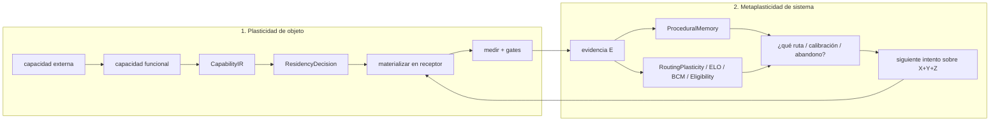
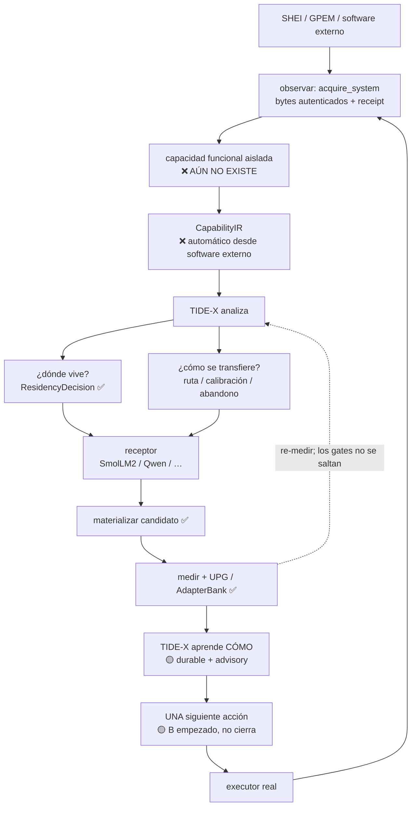

# TIDE-X: dos aprendizajes y los dos eslabones que faltan

**Fecha:** 2026-09-12 (Europe/Madrid)  
**Checkout:** `/home/yo/Future` @ `feat/durable-plasticity-controllers` — Paso 1 ✅ CLOSED; Paso 2 ✅; Paso 3 ✅ (NextAction + live B-loop proof); Paso 4 🟡→🟢 (AuthenticatedCapacity + live GPEM donor wire); Paso 5 ✅ (ResidencyDecision + Weights/Hybrid→measured IR→receptor vertical closed at max real level); Paso 6 ✅ ACCEPTED (Software vertical unchanged)  
**Contexto de código:** [PR #1](https://github.com/sheilyneural-afk/TIDEX/pull/1) — controladores durables + coevolución causal + `plan_next_tick`. Aún no es el organismo cerrado.  
**Naturaleza de este doc:** dos partes explícitas. **Parte I** = mapa del problema (qué falta y por qué; los dos eslabones siguen siendo el mapa correcto). **Parte II** = orden de implementación (camino crítico de 6 pasos; **no** es el mismo orden que el mapa). No es código. No pide algoritmos nuevos de plasticidad.

**Ver también:** [TIDEX_PLASTICITY_MODULES_STUDY.md](TIDEX_PLASTICITY_MODULES_STUDY.md) · [TIDEX_SHEI_ARCHAEOLOGICAL_MATRIX.md](TIDEX_SHEI_ARCHAEOLOGICAL_MATRIX.md) · [SHEI_TO_TIDEX_SOTA_MAP.md](SHEI_TO_TIDEX_SOTA_MAP.md) · [systems/learning-and-plasticity.md](systems/learning-and-plasticity.md) · [ARCHITECTURE.md](ARCHITECTURE.md)

---

## Valoración (visión vs estado)

| Juicio | Estado |
|--------|--------|
| Visión de producto / dos aprendizajes / dos eslabones / B antes que A / no más BCM / residencia antes que IR / coordinador = workflow | **CORRECTO** |
| Paso 1 (plasticidad durable) | ✅ **CLOSED / CERTIFIED** — plasticidad durable certificada; 18+ tests; no más plasticidad |
| Paso 2 (ProceduralMemory útil) | ✅ **DONE** — receipts → replay → ProceduralMemory → retrieve (`bc531d7` + 2B/2C fold) |
| Paso 3 (cerrar `NextAction` → executor) | ✅ **DONE** — `NextAction` @ `3ccd61f` + live B-loop proof (`tidex workflow prove-b-loop` / `prove_b_loop_real_evidence_start_receipt_redecide`): decide → Start → receipt → replay → redecide |
| Paso 4 (adquisición funcional) | 🟡→🟢 **LIVE DONOR WIRED** — `AuthenticatedCapacity` + `GpemV2RecommendDonorWire::observe` → SHEI `recommend_v2` (fail-closed; no fixture substitute) |
| Paso 5 (residencia / IR) | ✅ — package → ResidencyDecision; **Weights/Hybrid→measured IR→receptor** closed in separate vertical (`weights_ir_receptor_vertical`) — not invented from source trees; GPEM procedure-selector stays Software |
| Paso 6 (demo real) | ✅ **ACCEPTED (Software vertical)** — `tidex demo procedure-selector` remains Software stop + real B-loop. **Do not force GPEM into Weights.** Parallel demo: `tidex demo weights-ir-receptor` (measured closed linear map → Weights → IR → `compile_receiver_readout_capability`). |

---

## 0. Lectura en una frase

TIDE-X ya sabe **materializar** una `CapabilityIR` en un receptor y **decidir residencia** (Software | Hybrid | Weights | Unknown). El eslabón **A** (software externo → capacidad autenticada → `CapabilityIR`) tiene **capacidad autenticada** (Paso 4 DONE) y **residencia desde el paquete** (Paso 5 thin slice: Software válido; IR solo si Weights/Hybrid-warranted). El eslabón **B** (estado → decisión → executor → evidencia → siguiente decisión) está **cerrado a nivel decisor+prueba** (✅ Paso 3: `NextAction` + `prove_b_loop`): decide → Start real → receipt → replay → redecide. Sigue advisory respecto a promoción/UPG. El coordinador vive en la capa de *workflow*, no dentro de BrainEngine / KnowledgeEngine / AdapterBank. No hacen falta más BCM/ELO hasta cerrar los seis pasos de la Parte II.

**Congelación de aceptación:** congelar desarrollo lateral hasta poder demostrar: TIDE-X recibió evidencia nueva, recordó experiencia previa, eligió una acción distinta *por* esa experiencia, ejecutó un executor real, y re-decidió tras el resultado — sin que un humano pulse el siguiente botón.

**Invariante:** `evidencia → ResidencyDecision → CapabilityIR` (nunca `código → CapabilityIR`). La residencia Software es inteligencia válida.

---

# Parte I — Mapa del problema

Los **dos eslabones siguen siendo el mapa correcto**. A = 🟡→🟢 (capacidad + residencia; IR aún gated/no inventado). B = 🟢 at decisor+proof (Paso 3 B-loop closed); A still 🟡 (real donor / IR). Esta parte **no** es el orden en que hay que implementar: eso es la Parte II.

---

## 1. Dos aprendizajes distintos (no mezclar)

Hay **dos plasticidades**. Confundirlas produce módulos de más y el ciclo de menos.

### 1.1 Plasticidad de objeto — “trasplantar una capacidad a un receptor”

Es la capacidad **externa** (un sistema, un procedimiento, un modelo donante) convertida en algo que un LLM receptor (SmolLM2, Qwen, …) puede **alojar** de forma gobernada.

```text
capacidad externa (SHEI / GPEM / otro)
        │
        ▼
aislar capacidad funcional autenticada
        │
        ▼
   CapabilityIR          ← contrato formal, no “el código tal cual”
        │
        ▼
 ResidencyDecision       ← ¿dónde debe vivir?
        │
        ▼
materializar en el receptor
  low-rank / sparse / steering / controller / software binding…
        │
        ▼
medir + gates (UPG / AdapterBank)  →  promover o abandonar
```

Esto **ya tiene tramo desarrollado** *a partir de* `CapabilityIR` (cola ya existente):
`src/capability/capability_ir.rs` → `ResidencyDecision` → receiver / materialization.

El tramo **roto** está *antes*: software externo observado ≠ capacidad funcional formal ≠ `CapabilityIR`.

Ese diagrama de cola **no** es el método de adquisición. Para software externo el orden correcto es el de §5.1: evidencia observada → `ResidencyDecision` → **solo entonces** `CapabilityIR` si la evidencia lo permite. Inventar el IR leyendo código GPEM es el anti-patrón.

### 1.2 Metaplasticidad de sistema — “aprender CÓMO trasplantar”

TIDE-X debe aprender, con evidencia, **cómo** transplantar para la tupla:

```text
(capacidad X  +  receptor Y  +  arquitectura Z  +  evidencia E)
```

Es decir: qué ruta, qué calibración, cuándo abandonar. Órganos que ya existen para esto:

| Órgano | Rol en la metaplasticidad | Estado honesto post-PR#1 |
|--------|---------------------------|--------------------------|
| `ProceduralMemory` | recuerda qué procedimientos / intentos funcionaron | **reducer acotado no persistente** (derivado); `retrieve` es `pub`; `record_attempt`/`rebuild` son `pub(crate)`. Paths productivos **aún no** lo consumen en el decisor global — **la fuga más grande** de “cuanto más trabaja, mejor sabe qué hacer” |
| `RoutingPlasticity` | adapta pesos de ruta con evidencia medida | durable en `controller_state.json`; **sigue advisory** |
| `ELOSystem` | ranking relativo de entidades | durable; advisory |
| `BCMMetaplasticity` | umbral / sensibilidad | durable; advisory |
| `EligibilityTraces` | crédito temporal | durable; advisory |
| `KnowledgeEngine` | autoridad fail-closed; **no** es el coordinador del ciclo | órganos sí; no encadena observe→decide→execute |
| `BidirectionalLoop.plan_next_tick` → `CoEvolutionDirective` | propone discovery / transfer / hold y sesga routing/PI | **existe y es causal**; **sigue advisory**; no elige executor ni arranca job |

La metaplasticidad **mejora decisiones futuras**. No sustituye re-medir ni pasar gates. Un rating ELO alto no es promoción. Un `CoEvolutionDirective` no es un job ejecutado.



---

## 2. `ResidencyDecision` — no siempre son pesos

Tipo vivo: `src/governance/residency_decision.rs` (`Software` | `Weights` | `Hybrid` | `Blocked` | `BoundedUnknown`).

La visión de producto (mapeo informal → enum):

| Visión | Enum | Cuándo |
|--------|------|--------|
| Software | `Software` | La capacidad **debe** quedarse como procedimiento autenticado. Ejemplo: GPEM / provenance durable — el valor es el ledger, no un peso. |
| Weights | `Weights` | La capacidad es una función que el receptor puede **alojar** (low-rank, sparse, steering, controller). |
| Hybrid | `Hybrid` | El LLM decide *qué* buscar / *cuándo* invocar; el software hace el retrieve exacto autenticado. |
| Unknown → investigar | `BoundedUnknown` (+ obligaciones) | No hay evidencia bastante. **No se inventa residencia.** Se investiga. |
| Bloqueado | `Blocked` | Evidencia dice que no se puede alojar (política / integridad). |

Ejemplos de la visión, no recetas de código:

1. **GPEM, provenance durable** → casi siempre `Software`. Meterlo en pesos pierde exactamente lo que lo hace GPEM (append-only, autenticado, reversible).
2. **“¿Qué procedimiento pasado es relevante para este caso?”** → puede ser `Weights` (el receptor aprende a *reconocer analogía*) o `Hybrid` (el receptor propone candidatos; `ProceduralMemory.retrieve` autentica).
3. **Retrieve histórico exacto y autenticado** → `Hybrid`: el LLM no es la fuente de verdad del byte; el software sí.

`ResidencyDecision` **ya existe y decide**. El hueco no es el enum. El hueco es quién **alimenta** esa decisión desde una capacidad externa *observada* (conducta + contratos + evidencia causal — no semántica inventada al leer el árbol), y quién **ejecuta** la residencia elegida como siguiente acción real del organismo.

**Invariante (repetido a propósito):** `evidencia → ResidencyDecision → CapabilityIR`. Nunca `código → CapabilityIR`. La residencia Software es inteligencia válida.

---

## 3. Ciclo completo (el organismo)



ASCII equivalente:

```text
SHEI / GPEM
    │  acquire_system = bytes autenticados
    │  (NO “entendido”, NO “pasado a pesos”)
    ▼
capacidad funcional observada          ← eslabón A, 🟡 authenticated_capacity
    │
    ▼
CapabilityIR                           ← eslabón A, ❌ (auto)
    │
    ▼
TIDE-X analiza
    ├─ ¿dónde vive?   ResidencyDecision     ✅
    └─ ¿cómo se transfiere? ruta / cal / stop
    │
    ▼
receptor (SmolLM2 / Qwen / …)
    │
    ▼
materializar → medir → gates           ✅
    │
    ▼
TIDE-X aprende (metaplasticidad)       🟡 durable, aún advisory
    │
    ▼
UNA siguiente acción + executor real   ← eslabón B, 🟡 empezado, no cerrado
    │                                    (directive ≠ job; retrieve no gobierna)
    └──► loop
```

---

## 4. Estado honesto — 2026-09-12, después del trabajo de plasticidad de PR#1

PR: https://github.com/sheilyneural-afk/TIDEX/pull/1  
Rama local alineada: `feat/durable-plasticity-controllers` @ `456d1eb`  
(*durable controllers + causal coevolution + `plan_next_tick`; el PR seguía OPEN en esta fecha.*)

**Certificación Paso 1 (CLOSED) — 2026-09-12 ~05:10 CEST:**

```text
checkout: feat/durable-plasticity-controllers @ 456d1eb (+ docs certify commit)
cargo test --features cross-model-plasticity plasticity
→ 18 passed / 0 failed
cargo test --features cross-model-plasticity --lib 'operator::control_plane::tests'
→ 22 passed / 0 failed  (incluye advice / persist / causal / loop)
cargo check --features cross-model-plasticity  → ok
cargo check --no-default-features             → ok
cargo check (default)                         → ok
```

Cubre: persistencia entre llamadas, *newer-valid*, intervenciones causales, `BidirectionalLoop` durable (sin doble-registro), `plan_next_tick` cambia el consejo siguiente, sellado `evidence_sha256`, carga fail-closed de `config/plasticity.toml`. **Sin huecos de código Paso-1** (no se abrió hardening de algoritmos). Sigue **AdvisoryOnly**.

| Pregunta de organismo | Estado | Nota de disco |
|-----------------------|--------|----------------|
| TIDE-X mejora *cómo trabaja* a medida que acumula evidencia | 🟡 parcial / avanzado | `controller_state.json` durable; merge *newer-valid*; `plan_next_tick` emite `CoEvolutionDirective` sobre routing/PI; filtro causal de intervención; updates durables de routing/PI. **Sigue advisory.** Tests de plasticidad: 18/0. |
| Decide solo qué ruta tomar | 🟡 parcial | Routing + directive existen; no fuerzan el siguiente job / `target_model` |
| Recuerda qué estrategias funcionaron | 🟡 memoria derivada, no gobierna | `ProceduralMemory` = reducer acotado no persistente; `retrieve` existe; **ningún path productivo lo consume en el decisor global**; aún no hay replay canónico desde receipts |
| Observa software externo tipo GPEM | 🟡 captura, no comprensión | `acquire_system` sella bytes + envelope + receipt; el binario **declara** que no entiende ni transfiere a pesos |
| GPEM → capacidad funcional formal | ❌ | no hay aislamiento de “qué hace” autenticado (conducta observada + contratos + evidencia causal) |
| Capacidad → `CapabilityIR` automático | ❌ | el IR se compila cuando ya existe el contrato; no se induce desde evidencia; **no** se inventa leyendo el árbol |
| `CapabilityIR` → receptor | ✅ desarrollado | receiver compiler / binding / materializers |
| Elegir Software / Hybrid / Weights | ✅ | `ResidencyDecision` (+ `Blocked` / `BoundedUnknown`) |
| Materializar candidato | ✅ | low-rank / sparse / steering / shadow / compiler universal |
| Validar / gobernar / promover | ✅ | UPG + AdapterBank; materializar ≠ activar |
| Transición final B: directive + routing + retrieve + KE → executor → `start_operator_job(...)` | ❌ | **el corte que deja B en 🟡** |
| Bucle autónomo cerrado sin cableado humano | ❌ **hueco de cierre** | órganos sí; coordinador de workflow no; A ausente |

Leyenda: ✅ existe y se usa · 🟡 existe a medias / advisory / no gobierna / empezado no cerrado · ❌ no existe el tramo.

### Qué cambió con PR#1 (y qué no)

El estudio [TIDEX_PLASTICITY_MODULES_STUDY.md](TIDEX_PLASTICITY_MODULES_STUDY.md) describe el mundo *antes* de la persistencia (controllers efímeros por request). PR#1 cierra **una** de aquellas recomendaciones: snapshot durable + coevolución causal + `plan_next_tick`. Eso **abre** el eslabón B; **no** lo cierra.

**No** cierra el organismo:

- la directiva no ejecuta (`CoEvolutionDirective` ≠ `start_operator_job`);
- `ProceduralMemory.retrieve` no gobierna el decisor global (y la memoria aún no se reconstruye por replay canónico desde receipts autenticados);
- `acquire_system` no produce capacidad ni IR;
- no hay un solo decisor de *workflow* que emita `NextAction` y la mande a un executor registrado;
- la frontera de composición Operator ↔ KnowledgeEngine / ProceduralMemory aún no está decidida explícitamente (§8, antes del Paso 3).

---

## 5. Los dos eslabones (el trabajo de verdad)

No son veinte módulos. Son **dos uniones**. A = ❌. B = 🟡.

### 5.1 Eslabón A — de software externo a `CapabilityIR` (🟡→🟢 capacidad + residencia; IR gated)

```text
SOFTWARE EXTERNO
    →  capacidad funcional autenticada
    →  CapabilityIR
```

Hoy el corte es:

| Tramo | Existe |
|-------|--------|
| Capturar árbol / envelope / receipt (`acquire_system`) | sí — bytes, no semántica |
| Ejecutar al donante para *observar conducta* | 🟡 fixture donor + wire GPEM (`authenticated_capacity`); `acquire_system` sigue sin ejecutar |
| Aislar “esta es la capacidad X, con contrato Y” | ✅ paquete sellado `tidex.authenticated_capacity/v1` (Paso 4 @ `8592123`) |
| Residencia desde evidencia autenticada | ✅ `decide_from_authenticated_capacity` → Software / Hybrid / Weights / BoundedUnknown (Paso 5) |
| Compilar eso a `CapabilityIR` sin inventar semántica | 🟡 path gated (Weights / Hybrid-warranted); Software detiene sin IR; no inventa IR desde código |
| A partir del IR: residency + receptor + materialize | sí (cola desarrollada) |

Hasta que A exista, “observar GPEM” es **archivo en la caja fuerte**, no **órgano transplantable**.

#### Método de A (anti-patrón vs camino)

**NO:** leer código GPEM → adivinar qué hace → inventar `CapabilityIR`. Eso es frágil: semántica inventada, no capacidad autenticada.

**SÍ:**

```text
conducta real observada
  + contratos funcionales
  + evidencia causal
        │
        ▼
 ResidencyDecision
   (Software | Hybrid | Weights | BoundedUnknown)
        │
        ▼
 CapabilityIR          ← solo si la evidencia lo permite
        │
        ▼
 receiver compiler     ← solo si la residencia y el IR lo autorizan
```

El código capturado es **provenance / análisis**, no semántica inventada. Fail-closed: si no se puede aislar la capacidad, `BoundedUnknown` con obligaciones — nunca un peso ni un IR de ficción.

### 5.2 Eslabón B — de estado a la siguiente acción real (🟡 empezado, no cerrado)

```text
estado + historia + plasticidad + knowledge
    →  UNA decisión de siguiente acción
    →  executor real
    →  evidencia nueva
    →  ↺
```

**Ya existe (por eso B no es ❌):**

- plasticidad durable (`controller_state.json`);
- merge *newer-valid*;
- `plan_next_tick`;
- `CoEvolutionDirective`;
- filtro causal de intervención;
- updates durables de routing / PI;
- carga fail-closed de `config/plasticity.toml` en `compute_operator_plasticity_advice()` (la configuración **gobierna los controladores advisory**; no se convierte en autoridad de ejecución/promoción).

**Falta la transición final (por eso B no está cerrado):**

```text
CoEvolutionDirective
  + RoutingPlasticity
  + ProceduralMemory.retrieve   ← tras replay canónico (Paso 2)
  + KnowledgeEngine
        │
        ▼
 elegir un executor real existente
        │
        ▼
 start_operator_job(...)
        │
        ▼
 evidencia nueva → siguiente decisión
```

Hoy el corte:

| Pieza | Existe | ¿Gobierna el siguiente tick? |
|-------|--------|------------------------------|
| Estado plástico durable | sí, PR#1 (18 tests) | no (advisory) |
| Historia de coevolución | sí, PR#1 | no (directive no es job) |
| `plan_next_tick` / `CoEvolutionDirective` | sí | no |
| Filtro causal de intervención | sí | no (filtra; no ejecuta) |
| Updates durables routing / PI | sí | sesgan consejo; no arrancan job |
| `config/plasticity.toml` | sí — cargado fail-closed en `compute_operator_plasticity_advice()` | gobierna controladores **advisory**; no es autoridad de ejecución/promoción |
| `ProceduralMemory` | sí (reducer derivado; `retrieve` pub) | no — falta replay canónico + consumo en el decisor |
| `KnowledgeEngine` | sí | autoridad, no coordinador de ciclo |
| Un decisor que elige **una** acción y la manda a un executor | no | — |
| Evidencia nueva que vuelve a alimentar A y B | parcial (jobs / receipts) | no cierra solo |

Hasta que B **cierre**, TIDE-X **proyecta** qué haría un organismo. No **es** el organismo. La fuga más cara: `ProceduralMemory` ya sabe rankear procedimientos; el decisor global no lo pregunta — y aún no se reconstruye desde receipts autenticados.

### 5.3 Dónde vive el coordinador (colocación, no un cerebro nuevo)

**No** meter el coordinador dentro de BrainEngine, KnowledgeEngine ni AdapterBank. Esas son autoridades **distintas y legítimas**. Meterle ahí mezcla “qué es verdad / qué se promueve / qué se activa” con “qué conviene correr ahora”.

El coordinador vive en la capa de **workflow / composición** ([ARCHITECTURE.md](ARCHITECTURE.md): workflow, no una quinta autoridad). Produce algo conceptualmente así:

```text
NextAction {
  executor_id,                 ← entre executors EXISTENTES
  authenticated_inputs,
  rationale_evidence,
  expected_information_gain,
  cost,
  risk,
  stop_condition
}
```

**Agudeza de `NextAction`:** no es un planner genérico. Solo responde: *¿cuál de las acciones admisibles ahora produce más evidencia/progreso esperada, dado lo que sé y lo que funcionó?* Debe elegir entre **executors ya existentes**. No inventa capacidades nuevas ni promociona.

Ejemplo concreto de trasplante (agudeza, no teatro):

```text
KE: falta causalidad suficiente
ProceduralMemory: steering falló 4/5; low-rank acertó 6/7
RoutingPlasticity: prefiere ruta B
CoEvolutionDirective: transfer
calibración: insuficiente
        │
        ▼
NextAction = cross_model.align
  reason: calibration_required_before_transfer
        │
        ▼  (más tarde, con evidencia)
transfer_steering  |  abandon_current_strategy
```

**No** decide verdad, promoción ni activación a producción. Solo: *dado lo que sabemos, esta es la siguiente acción admisible que vale la pena correr*. Las autoridades existentes verifican el resultado.

---

## 6. Lo que explícitamente NO hace falta

No hacen falta más BCM, más ELO, más controladores, más memorias ni más planners de plasticidad.

BrainEngine se partió por autoridades de forma correcta: los órganos existen (`KnowledgeEngine`, `AdapterBank`, `UniversalPromotionGate`, `ResidencyDecision`, receiver, materialization, `plasticity/*`, `ProceduralMemory`, `BidirectionalLoop`).

Falta el **coordinador de workflow** que encadene:

```text
observar → entender → decidir → ejecutar → medir → aprender → decidir otra vez
```

**Regla explícita:** no añadir más algoritmos de plasticidad (BCM / controladores / memorias / planners) hasta cerrar los **seis pasos** de la Parte II. Órganos sin coordinador pierden la visión original: TIDE-X sabiendo qué hacer después **sin que un humano cablee cada paso**.

Cualquier módulo nuevo que no sea un tramo de esos seis pasos es trabajo lateral. **Congelar** ese lateral hasta la demostración de aceptación (§0).

---

## 7. PR#1 en su sitio (citar, no mitificar)

- URL: https://github.com/sheilyneural-afk/TIDEX/pull/1  
- Título: *feat: durable operator plasticity controllers*
- Checkout local: `feat/durable-plasticity-controllers` @ `456d1eb`
- Qué entrega: persistencia sellada en `{tidex_home}/operator/plasticity/controller_state.json`; `BidirectionalLoop` durable (`coevolution_history` + `applied_coevolution_keys`); `plan_next_tick` → `CoEvolutionDirective` (discovery / transfer / hold + sesgo routing/PI); *newer-valid*; filtro causal de intervención; fail-closed; feature `cross-model-plasticity`; **sigue AdvisoryOnly**.
- Config: PR#1 **sí** carga `config/plasticity.toml` fail-closed en `compute_operator_plasticity_advice()`. **La configuración gobierna los controladores advisory; no se convierte en autoridad de ejecución/promoción.** El loader **no** está “pendiente de entregar”.
- Certificación de tests (usuario): `cargo test --features cross-model-plasticity plasticity` → **18 passed / 0 failed** (persistencia entre llamadas, *newer-valid*, intervenciones causales, loop durable, `plan_next_tick` cambia consejo).
- Qué no entrega: el ciclo cerrado de la §3, el eslabón A, el **cierre** del eslabón B (directive → executor → job), autoridad de promoción, ni un segundo store de ProceduralMemory.

PR#1 es **metaplasticidad incipiente** y el **arranque de B**. No es el organismo. No mitificarlo como “B cerrado”. Paso 1 **CLOSED / CERTIFIED** 2026-09-12 (18 plasticity + 22 control_plane tests; check ± feature).

---

# Parte II — Orden de implementación

El mapa de la Parte I (A, luego B en el dibujo del organismo) **no** es el orden de trabajo. El camino crítico es **B primero** (cerrar lo ya empezado), **después A**, **después el demo acotado**.

---

## 8. Camino crítico (este orden, no otro)

Seis pasos. Este es el roadmap. No invertir, no saltar, no sustituir por otro BCM.

```text
1. CERTIFY 456d1eb
   (durable plasticity, causal coevolution, plan_next_tick,
    idempotence, replay, gates)
        │
        ▼
2. MAKE PROCEDURAL MEMORY USEFUL
   (receipts → canonical replay → ProceduralMemory → retrieve(context))
        │
        ▼
3. CLOSE WORKFLOW DECIDER
   (KE + CoEvolutionDirective + RoutingPlasticity + ProceduralMemory.retrieve
    + cost/risk/state → ONE NextAction → existing executor → real job → receipt → ↺)
        │
        ▼
4. FUNCTIONAL SOFTWARE ACQUISITION
   (real GPEM execution → observations / interventions /
    counterfactuals / contracts → authenticated capacity)
        │
        ▼
5. RESIDENCY / REPRESENTATION
   (evidence → ResidencyDecision Software|Hybrid|Weights|BoundedUnknown
    → CapabilityIR only when warranted)
        │
        ▼
6. REAL DEMO
   (GPEM → autonomous TIDE-X → small LLM → measure → learn how → better second attempt)
```

### Paso 1 — CERTIFY `456d1eb` (**CLOSED** 2026-09-12 @ tip `6b7d912`)

**Estado:** **CLOSED / CERTIFIED**. Sustancia en `456d1eb`; tip de rama de certificación / formato `6b7d912`; certificación re-ejecutada verde; roadmap + INDEX see-also empujados a la rama / PR#1. **No reabrir plasticidad.**

**Checklist certificación:**

| Ítem | Resultado |
|------|-----------|
| Persist / reload durable (`controller_state.json`) | ✅ tests |
| Idempotencia (mismo discovery no doble-registra) | ✅ `plasticity_advice_persists_bidirectional_loop_across_calls` |
| Replay de estado sellado + `evidence_sha256` | ✅ load/verify/persist + tests |
| *newer-valid* | ✅ |
| Gates / fail-closed (`plasticity.toml`, schema) | ✅ |
| Causal seal de intervenciones | ✅ |
| `plan_next_tick` / directive durable | ✅ |
| `cargo check` ± feature | ✅ |
| Nuevos algoritmos BCM/ELO/planners | ❌ no abiertos (correcto) |

**Anti-patrón (sigue vigente):** abrir otro controlador BCM/ELO/memoria. Congelado. Siguiente trabajo = Paso 2 (replay canónico → retrieve), no más Paso 1.

### Paso 2 — MAKE PROCEDURAL MEMORY USEFUL (replay canónico primero)

**Realidad de código (no negociar):** `ProceduralMemory` es un *“Bounded, non-persistent reducer”*. `record_attempt` / `rebuild` son `pub(crate)`; `retrieve` es `pub`. Es **buena arquitectura**: no debe convertirse en otra DB ni en otra autoridad.

**Anti-patrón explícito:** **NO** `operator/procedural_memory.json` ni segundo store de persistencia. La memoria se **deriva**.

Datos ya cerca:

- `NumericalEvolutionCycle` expone `procedural_attempt()`;
- `tidex numerical.evolve` lo incluye;
- las corridas Operator dejan stdout + hashes / receipts.

Paso 2 se parte en tres:

| Subpaso | Qué |
|---------|-----|
| **2A** | Reconstruir `ProceduralMemory` desde receipts históricos autenticados vía **replay canónico** |
| **2B** | `retrieve(query)` para contexto del siguiente tick |
| **2C** | Plegar ese consejo en la decisión (`NextAction`) |

Sin 2A, “conectar retrieve al decisor” sería teatro sobre memoria vacía o inventada. Sin 2B/2C, la memoria sigue siendo órgano muerto para el workflow.

**Inventario 2A (docs-only, post–Paso 1):**

| Fuente | Path / nota |
|--------|-------------|
| `ProceduralMemory` | `src/learning/procedural_memory.rs` — reducer; `rebuild`/`record_attempt` `pub(crate)`; `retrieve` `pub` |
| Emisión de intento | `NumericalEvolutionCycle::procedural_attempt()` en `src/learning/numerical_evolution.rs` |
| CLI stdout | `src/bin/tidex.rs` incluye `procedural_attempt` / `procedural_attempt_count` en ciclo numérico |
| Receipts Operator | `OperatorRunReceipt` + stdout bajo `{tidex_home}/operator/runs/by-sha/...` |
| Colección local | `collected_receipts/*.json` (muestras; no son aún el feed canónico de replay) |
| Frontera | `build.rs`: engine↛operator cruzado silencioso — replay debe componerse en workflow (`tidex.rs` / capa composición), no importar KE/PM dentro de Operator |

**Estado 2A (2026-09-12):** **DONE** @ `bc531d7` (`feat: canonical ProceduralMemory replay from authenticated evolve receipts`).

| Pieza | Path |
|-------|------|
| Replay canónico | `src/learning/procedural_replay.rs` — `rebuild_from_authenticated_receipt` dispatches by schema (numerical.evolve, operator run view, operator job with embedded stdout) → `ProceduralMemory::rebuild_with_solver_failures`. V67/V68 stay LearningExperimentEvidence-only. |
| 2B helper | `retrieve_procedural_advice(memory, query)` (advisory-only; Paso 3 hook documented in-module) |
| Composición Operator | `src/bin/tidex.rs` — `rebuild_procedural_memory_from_receipt_bytes` + CLI `tidex procedural replay` / `replay-from-run-receipt` (multi-schema; path-only Operator run receipts wrapped as `tidex.operator_run_view/v1`) |
| Tests | `procedural_replay::tests` — numerical + operator view/job ranked retrieve; unknown / Vxx / path-only run / job-evidence / tamper / digest / production / count fail-closed |

**No** `procedural_memory.json`. **No** import de PM/KE en `operator/control_plane.rs`. **2C / Paso 3:** plegado en `src/bin/workflow_next_action.rs` (`decide_next_action` → `invoke_next_action`).

### Antes del Paso 3 — frontera de composición (decidir explícitamente)

`build.rs` separa dominios:

```text
engine   → analysis, foundation, learning
operator → cross_model, foundation
```

Por tanto `operator/control_plane.rs` **no** puede importar a la ligera `KnowledgeEngine` / `ProceduralMemory` / `ResidencyDecision` sin romper deliberadamente la arquitectura.

La raíz de composición que hoy ve casi todo: `src/bin/tidex.rs`.

**Decisión de frontera (Paso 3):** el coordinador vive en `src/bin/workflow_next_action.rs` (módulo del bin `tidex`), que ya es raíz de composición. **Sin** importar KE/PM/Residency en `operator/control_plane.rs`. Los únicos añadidos en Operator son wrappers públicos del enqueue ya existente (`start_operator_direct_job` / `start_operator_behavioral_discovery_job`). El límite queda documentado en el módulo.

### Paso 3 — CLOSE WORKFLOW DECIDER (hito central) — ✅ **DONE** @ `3ccd61f` + B-loop proof

**Estado (2026-09-12):** coordinador de workflow en la raíz de composición del bin `tidex` (no dentro de BrainEngine / KnowledgeEngine / AdapterBank / `operator/control_plane.rs`).

| Pieza | Path |
|-------|------|
| Frontera | `src/bin/workflow_next_action.rs` — ve learning + operator sin romper `build.rs` |
| `NextAction` | schema `tidex.workflow.next_action/v1` — un executor existente, inputs autenticados, rationale, info-gain, cost/risk, stop |
| Decisión | `decide_next_action` pliega KE signals + `CoEvolutionDirective` snapshot + RoutingPreference + `ProceduralWorkflowHint` (desde `retrieve_procedural_advice`) |
| Job path | `invoke_next_action` DryRun/Start → `start_operator_direct_job` / `start_operator_behavioral_discovery_job` → private `start_operator_job` (mismo path HTTP) |
| CLI | `tidex workflow decide <workflow-decision-input.json>` (dry-run) |
| Tests | bin tests: steering-failed→`cross_model.align`; calibrated+reliable→`cross_model.transfer_steering`; fail-closed; dry-run hook |

La transición final de B:

```text
KnowledgeEngine
  + CoEvolutionDirective
  + RoutingPlasticity
  + ProceduralMemory.retrieve
  + cost / risk / state
        │
        ▼
  ONE NextAction          ← entre executors EXISTENTES
        │
        ▼
  existing executor
        │
        ▼
  real job → receipt
        │
        ▼
  ↺ (re-decidir)
```

Criterio de cierre de B (= congelación de aceptación §0): el sistema emite y **ejecuta** una sola siguiente acción, re-mide, actualiza estado plástico / procedural (vía replay), y la siguiente decisión **cambia por evidencia** — sin que un humano elija el job a mano. Los gates siguen siendo gates. El coordinador no promociona.

**Hecho en Paso 3:** decisión tipada + mapping a executor + Start hook. **B-loop proof (criterio §0):** `src/bin/workflow_b_loop.rs` — real `numerical.evolve` evidence → `rebuild_from_numerical_evolution_stdout` → retrieve→hint→`decide_next_action` → `invoke_next_action(Start)` → Operator job `evidence_receipt` → second real evolve → replay → **different** NextAction (calibrate→transfer) attributable to procedural retrieve (not hand-planted hints). CLI: `tidex workflow prove-b-loop`. Test: `prove_b_loop_real_evidence_start_receipt_redecide`. KE signals siguen siendo proyección advisory hacia el DTO.

Ver agudeza de `NextAction` y el ejemplo de trasplante en §5.3.

### Paso 4 — FUNCTIONAL SOFTWARE ACQUISITION — 🟡→🟢 **LIVE DONOR WIRED** (package @ `8592123`; live SHEI/GPEM observe+seal)

No más “archivo en la caja fuerte”. Observaciones / intervenciones / contrafácticos / contratos → **capacidad autenticada sellada**. El árbol capturado (`acquire_system`) queda como provenance. Este paso **no** inventa `CapabilityIR`.

**Estado (2026-09-12 / DONE @ `8592123`):**

| Pieza | Estado |
|-------|--------|
| Inventario | `acquire_system` + `acquisition_contract` + `content_vault` (bytes); Operator `behavioral_discovery` (LLM multi-model, no donor software); GPEM en `/home/yo/Projects/SHEI` (recommend vertical) |
| Módulo | `src/capability/authenticated_capacity.rs` |
| Schema | `tidex.authenticated_capacity/v1` |
| Persistencia | `state/acquisitions/authenticated-capacity/by-sha/{digest}.json` |
| Digest | `AuthenticatedCapacityDigest` (sealed, domain `TIDEX:AUTHENTICATED-CAPACITY:v1`) |
| Vertical | fixture `procedure_selector_or_explore` (select best historical **or** explore) |
| GPEM wire | `GpemV2RecommendDonorWire::observe` → `tools/gpem_v2_recommend_donor.py` → SHEI `create_gpem`/`get_gpem` → `GPEMService.recommend_v2` / `GPEMServiceV2.recommend`; fail-closed if unavailable |
| Tests | 6 unit tests (seal, tamper fail-closed, persist/reauth, GPEM wire, fixture policy) |
| Handoff Paso 5 | `ResidencyHandoffSummary` consumido por `decide_from_authenticated_capacity` (Paso 5) |

**Hecho:** evidencia observada → contratos funcionales → paquete autenticado con hashes/receipts fail-closed.  
**Live donor:** thin bridge (no GPEM copy inside TIDE-X). CI hermetic via store marker `.tidex_gpem_force_unavailable` / missing SHEI. Success path: seed governed traces then `seal_live_gpem_v2_recommend_capacity`.  
**Fuera de Paso 4:** `ResidencyDecision` / `CapabilityIR` (Paso 5 — hecho thin slice).

### Paso 5 — RESIDENCY / REPRESENTATION — ✅ (Software path + Weights/Hybrid→IR→receptor vertical)

Método de §5.1, no el anti-patrón:

```text
evidence
  → ResidencyDecision (Software | Hybrid | Weights | BoundedUnknown)
  → CapabilityIR only when warranted
```

| Pieza | Estado |
|-------|--------|
| Módulo | `src/governance/authenticated_capacity_residency.rs` |
| Reuse | `decide_from_fact_inputs` → `evaluate_fact_matrix` / `ResidencyDecision` |
| Schema outcome | `tidex.authenticated_capacity_residency/v1` |
| Persistencia | `state/residency_decision/from_authenticated_capacity/by-sha/{digest}.json` |
| Reglas | Insufficient → BoundedUnknown; donor software default → Software; `residency.*` Supported contracts + intervenciones → Weights/Hybrid via fact matrix |
| IR gate | `CapabilityIrPath`: Software/BoundedUnknown/Blocked stop; Weights admit; Hybrid only if causal+contract warrant; **nunca inventa IR** |
| Tests | 7 unit tests (Software fixture, thin BoundedUnknown, Weights, Hybrid, no-IR-from-Software, persist tamper, partial claims) |

Fail-closed a `BoundedUnknown` + obligaciones. Nunca un peso inventado. Nunca `código → CapabilityIR`. `ResidencyDecision::Software` es inteligencia válida.

**Cierre thin de A (residencia):** fixture/live procedure-selector produce `Software` justificada y detiene IR. Weights/Hybrid solo con evidencia causal+contratos explícitos.

#### Weights/Hybrid → CapabilityIR → receptor (vertical separado) — ✅ max real level

```text
measured closed linear map (DonorKind::MeasuredClosedLinearMap)
  + residency.* Supported contracts + causal interventions
  → ResidencyDecision::Weights (or Hybrid)
  → CapabilityIrPath::Admitted
  → CapabilityIR from measured_weights.json in authenticated envelope
    (NOT from GPEM/source trees; NOT procedure-selector)
  → execute_linear_readout + compile_receiver_readout_capability
```

| Pieza | Estado honesto |
|-------|----------------|
| Módulo | `src/governance/weights_ir_receptor_vertical.rs` |
| Warrant | measured margins + `residency.*` + AblateBestPrior intervention |
| Residency | Weights (primary) / Hybrid (admit path) |
| IR | emitted from measured descriptor bytes via `CapabilityIr::new_with_parameters` + capture envelope |
| Receptor | entered existing readout engines (`receiver_readout_compiled` when calibration allows; else measured execute only) |
| GPEM / procedure-selector | **rejected** by this vertical (Software-only elsewhere) |
| Fake weights / invent IR | forbidden; fail-closed |
| CLI | `tidex demo weights-ir-receptor` |
| Gaps | no full LLM transplant / no UPG promotion / no SmolLM2 safetensors write; experimental_only |

**Reproduce:**
```bash
export TIDEX_HOME=/tmp/tidex-weights-ir-demo-home
cargo run --bin tidex -- demo weights-ir-receptor
```

### Paso 6 — REAL DEMO — ✅ **ACCEPTED (Software vertical)**

```text
REQUIRED (frozen acceptance):
  live GPEM / real donor → authenticated capacity → ResidencyDecision
  → Software stop OR Weights/Hybrid with real IR → receptor only when admitted
  → real second tick from ProceduralMemory replay (not synthetic hints)

CURRENT (ACCEPTED — Software path):
  seed_live_gpem_demo_store (SHEI ingest) → live observe/seal
  → ResidencyDecision::Software → honest stop (no CapabilityIR, no receptor)
  → workflow_b_loop::prove_b_loop as non-synthetic second tick
  (calibrate_alignment → Start → receipt → activation_transfer_experiment)
  Fail-closed if GPEM unavailable (no FixtureProcedureSelector)
```

**Status: ✅ ACCEPTED for the Software vertical.** Frozen criterion explicitly allows Software stop as success. Weights/Hybrid → measured CapabilityIR + receptor is tracked on the **separate** Paso 5 vertical above (`tidex demo weights-ir-receptor`) — not claimed as part of this GPEM Software demo.

| Pieza | Estado honesto |
|-------|----------------|
| Donor live GPEM | ✅ wired + demo auto-seeds via `seed_demo_traces` / `ingest_payload` |
| Fixture donor | Unit-test only; **forbidden** on productive/demo path |
| Seal / Residency | ✅ live package → Software |
| IR / Receptor | ✅ correctly **not** entered under Software; Weights/Hybrid→IR is a **separate** vertical (see Paso 5) |
| CLI | ✅ `tidex demo procedure-selector` succeeds against seeded store on this machine |
| Second-tick | ✅ real B-loop (`prove_b_loop`), not fabricated ProceduralWorkflowHint |
| Tests | `seed_and_run_live_gpem_vertical_software_stop_when_shei_available`; `demo_seeded_live_gpem_plus_real_b_loop_when_shei_available`; fail-closed variants |

**Reproduce:**
```bash
export TIDEX_SHEI_ROOT=/home/yo/Projects/SHEI
export TIDEX_HOME=/tmp/tidex-paso6-demo-home
cargo run --bin tidex -- demo procedure-selector
```

### Fuera de este camino

No abrir Ola RALF / Minimum Space / otros BCM como sustituto de estos seis pasos. Esos mapas ([SHEI_TO_TIDEX_SOTA_MAP.md](SHEI_TO_TIDEX_SOTA_MAP.md), [TIDEX_SHEI_ARCHAEOLOGICAL_MATRIX.md](TIDEX_SHEI_ARCHAEOLOGICAL_MATRIX.md)) siguen válidos como arqueología; no son el camino crítico del organismo.

---

## 9. Relación con el resto del mapa

| Doc | Relación |
|-----|----------|
| [TIDEX_PLASTICITY_MODULES_STUDY.md](TIDEX_PLASTICITY_MODULES_STUDY.md) | Anatomía de controllers vs `PlasticityEngine`. Pre-PR#1 en persistencia; este doc actualiza el *significado* de ese estudio y el orden de trabajo. |
| [SHEI_TO_TIDEX_SOTA_MAP.md](SHEI_TO_TIDEX_SOTA_MAP.md) | Qué portar de SHEI. Este doc dice *por qué* GPEM no es “pásalo a pesos” y *cómo* no inventar IR leyendo código. |
| [TIDEX_SHEI_ARCHAEOLOGICAL_MATRIX.md](TIDEX_SHEI_ARCHAEOLOGICAL_MATRIX.md) | HAVE/PARTIAL/MISS. Este doc recorta el crítico a dos uniones y a seis pasos. |
| [ARCHITECTURE.md](ARCHITECTURE.md) | Capas autoridad / workflow / evidencia. El coordinador **vive en workflow**; no entra en BrainEngine, KnowledgeEngine ni AdapterBank; no crea una quinta autoridad. Frontera `build.rs` engine↔operator debe respetarse al componer `NextAction`. |
| [systems/learning-and-plasticity.md](systems/learning-and-plasticity.md) | Piezas de learning. Este doc es la visión de ciclo + el orden, no el inventario de archivos. |

---

*Doc de mapa (Parte I) + orden de implementación (Parte II). No pide módulos nuevos de plasticidad. Paso 1 ✅. Paso 2 ✅. Paso 3 ✅. Paso 4 🟡→🟢. Paso 5 ✅ (incl. Weights/Hybrid→measured IR→receptor vertical). Paso 6 ✅ ACCEPTED Software vertical (GPEM stays Software). Sin `procedural_memory.json`. evidencia → ResidencyDecision → CapabilityIR.*
